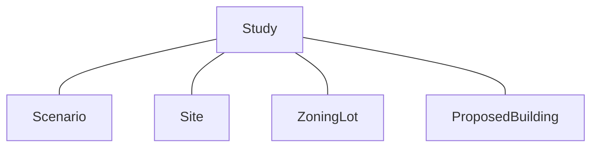
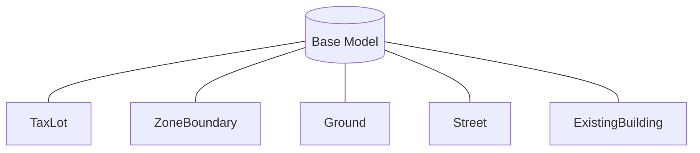
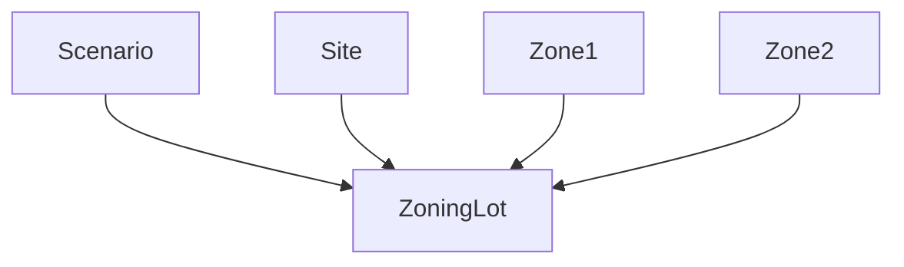
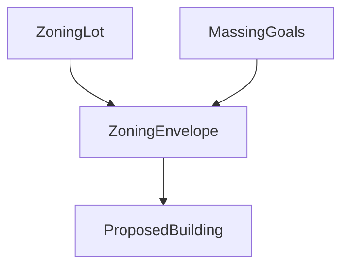

# UDTools Core

This subdirectory contains a common data model and API used in UDTools. The data model is expressed as protobufs and API is implemented in a gRPC-enabled server written in python to provide various clients with model generation and zoning analysis functionality.

## Data Model Overview

When working in UDTools, a `study` object holds a collection of all active analysis elements:



The base model provided by the NYC Digital Twin provides geometric context for other elements, depending in particular on those shown below. Other layers provided by the Digital Twin are used for geometry/analysis only.



`ZoningLot` objects express a frame of possibility for a specific place, time and set of conditions. They are created from a defined `Scenario`, `Site` and list of applicable `Zone` objects:



Once created, the `ZoningLot` can be used in conjunction with defined `MassingGoals` to produce `ProposedBuildings`:



`ProposedBuilding`, `Scenario` and `Study` all provide summary functions to preview and export development metrics at each scope: for individual buildings, across an entire scenario, and across all scenarios + increment. `ProposedBuildings` have an IFC-like structuer and will eventually provide IFC import/export functions allowing for buildings to be placed and analyzed without requiring generation from a zoning lot.

## Code Generation

### Python

To generate updated python code for the server, run:

```sh
python -m grpc_tools.protoc \
  -I ./proto \
  --python_out=./python/generated \
  --grpc_python_out=./python/generated \
  ./proto/*.proto
```

Then:

```sh
gsed -i -E "s/^import.*_pb2/from . \0/" ./python/generated/*.py
```

This fixes imports as shown [here](https://towardsdatascience.com/implementing-grpc-server-using-python-9dc42e8daea0), note you need to use GNU sed on MacOS for this to work. As of 2021-03-04 there are a whole bunch of issues on the `grpc` repo about this but doesn't appear to be something that can be easily fixed. 

### Javascript (Web Client)

To generate for client-side js, you need the `protoc` compiler and `protoc-gen-grpc-web` installed. Then, from this directory, run:

```sh
protoc -I=./proto \
  ./proto/*.proto \
  --js_out=import_style=commonjs:./js \
  --grpc-web_out=import_style=commonjs,mode=grpcwebtext:./js
```

To use this in development, you'll need to:

1. Run the server: `python server.py` from the `python` directory.
2. Run a proxy to pass http requests from the browser to the server as HTTP/2-enabled gRPC messages: (`docker-compose up proxy` from the  `docker` directory)

A sample web client is provided under `js`, run it with `python3 -m http.server 8082`, or see the `udtools-rpc-test` page in the `ud-interactive` repo.

### C#

(COMING SOON)

## Documentation

Markdown documentation for the API can be auto-generated with `protoc-gen-doc` by running the following docker command from this directory:

```sh
docker run --rm \
  -v $(pwd)/docs:/out \
  -v $(pwd)/proto:/protos \
  pseudomuto/protoc-gen-doc --doc_opt=markdown,docs.md
```

## Resources

- [gRPC docs](https://grpc.io/docs/)
- [Protocol Buffer Style Guide](https://developers.google.com/protocol-buffers/docs/style)
- [OpenCASCADE Guide](https://dev.opencascade.org/doc/refman/html/)
- [OpenCASCADE API Docs](https://dev.opencascade.org/doc/overview/html/index.html)
- [OpenCASCADE Google Group](https://groups.google.com/g/oce-dev/c/F2K4ISkFjaw?pli=1)
- [PostGIS docs](https://postgis.net/docs/)
- [Debugging Python in VS Code](https://code.visualstudio.com/docs/python/debugging)
